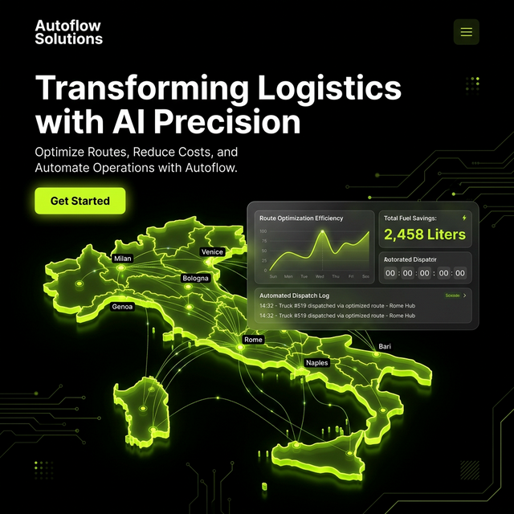

# Italian Logistics AI Campaign: Marketing Assets

## 1. Landing Page Visual Mockup
This mockup illustrates the "Enterprise AI" look for Autoflow Solutions. It uses dark mode (`#000000`) with precise Chartreuse accents and glows (`#c4ef17`) to project modern stability.

---

## 2. 2-Week Social Media Calendar (Bilingual)
**Goal:** Awareness, Authority, and Lead Generation.
**Primary Channel:** LinkedIn.

### Week 1: The "Pain & Agony" Phase
*   **Day 1 (Mon):**
    *   **ITA:** "I tuoi addetti al traffico sono gli eroi della tua azienda, ma la loro 'conoscenza verbale' è il tuo più grande collo di bottiglia. Cosa succederebbe se andassero in pensione domani?"
    *   **ENG:** "Your dispatchers are the heroes of your business, but their 'tribal knowledge' is your biggest bottleneck. What happens if they retire tomorrow?"
*   **Day 3 (Wed):**
    *   **ITA:** "Sapevi che le flotte regionali italiane perdono una media di €0,24 al chilometro a causa di percorsi sub-ottimali? Ecco i calcoli..."
    *   **ENG:** "Did you know that regional Italian fleets lose an average of €0.24 per kilometer due to sub-optimal routing? Here’s the math..."
*   **Day 5 (Fri):**
    *   **ITA:** "Le zone ZTL e le strade strette non sono un problema per l'IA. Ecco come il nostro Dispatcher Personalizzato gestisce il centro di Bologna in tempo reale."
    *   **ENG:** "ZTL zones and narrow streets aren't a problem for AI. Here’s how our Custom Dispatcher handles the Bologna city center in real-time."

### Week 2: The "Solution & ROI" Phase
*   **Day 8 (Mon):**
    *   **ITA:** "Come una flotta regionale in Lombardia ha aumentato l'uso dei veicoli del 15% utilizzando il motore NEXUS."
    *   **ENG:** "How a regional fleet in Lombardy increased vehicle utilization by 15% using the NEXUS engine."
*   **Day 10 (Wed):**
    *   **ITA:** "Stiamo eseguendo 3 'Audit Profit-Loss & AI' personalizzati questo mese per la logistica PMI italiana. Scopri quanto PUOI risparmiare."
    *   **ENG:** "We’re running 3 customized 'Profit-Loss & AI Audits' this month for Italian SME logistics. See how much YOU can save."
*   **Day 12 (Fri):**
    *   **ITA:** "Non promettiamo solo risultati. Ogni soluzione Autoflow supera un rigido controllo di qualità prima del dispiegamento."
    *   **ENG:** "We don't just promise results. Every Autoflow solution passes a strict quality gate before deployment."

---

## 3. Ad Creative Hooks
*   **ITA:** "Percorsi più intelligenti. Meno carburante. Autisti più felici. Il futuro della logistica italiana inizia qui."
*   **ENG:** "Smarter routes. Lower fuel. Happier drivers. The future of Italian logistics starts here."
